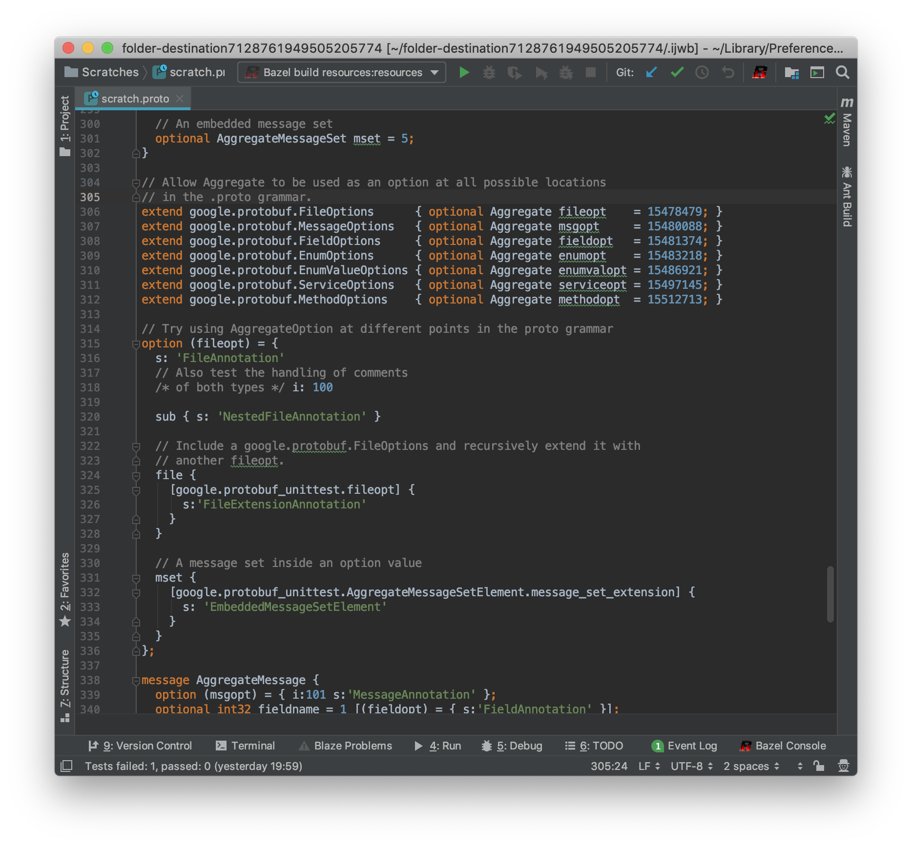

# Protocol Buffers support for IntelliJ

This plugin provides editor support for Protocol Buffer files, including text
format.

# Features



* Support for `proto2` and `proto3`
* Syntax highlighting
* Completion
* Semantic analysis
* References and navigation
* Quick documentation
* Editor enhancements (completion, brace matching, etc.)
* Navigating between protobuf files and some other languages (Java, Go, Python)
* Full support for text format, both standalone and in custom options


## Building and Testing

To build `plugin.jar`:

```
bazel build //plugin
```

The core plugin, java, and python support can be tested against IDEA Community.
Go support must be tested against IDEA Ultimate.

```
bazel test //core/...
bazel test //java/...
bazel test //python/...
bazel test //golang/... --define=ij_product=intellij-ue-latest
```
