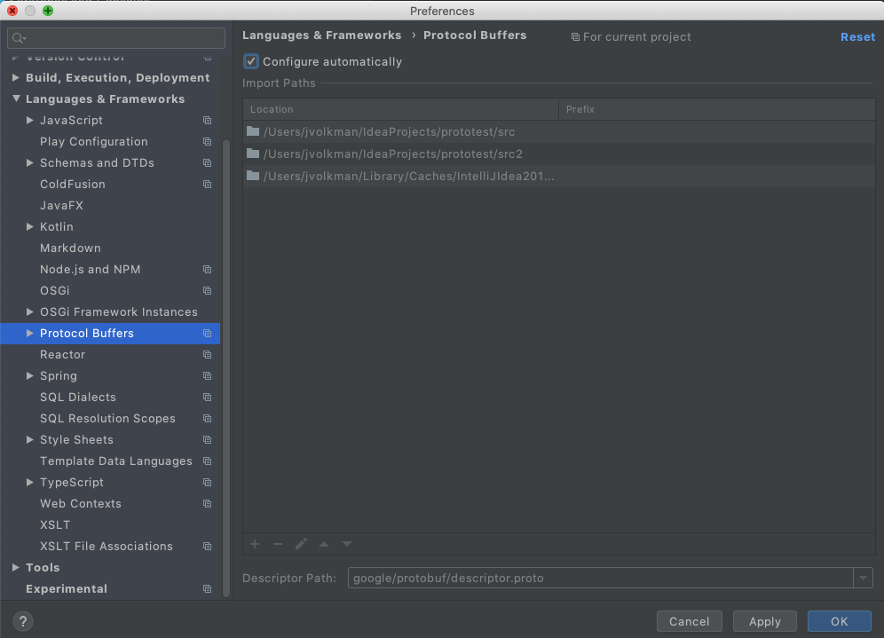
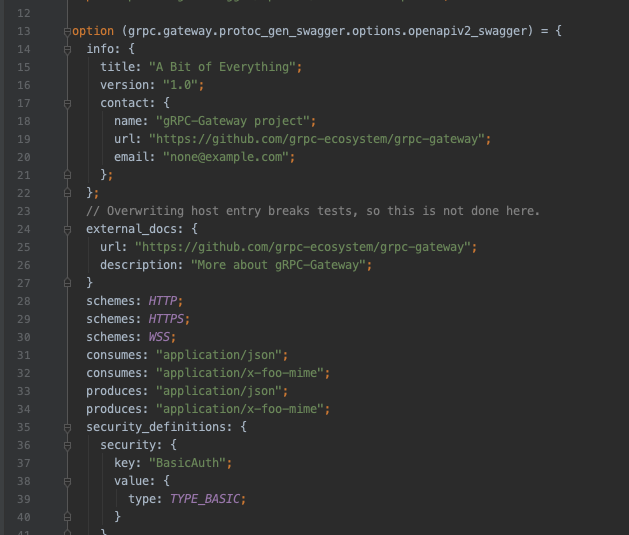

# Protocol Buffers support for IntelliJ


This plugin provides editor support for Protocol Buffer files, including text
format.

This is a fork of an editor developed internally at Google and released unsupported 
[here](https://github.com/google/intellij-protocol-buffer-editor).

# Features


* Support for `proto2` and `proto3`
* Syntax highlighting
* Completion
* Semantic analysis
* References and navigation
* Quick documentation
* Editor enhancements (completion, brace matching, etc.)
* Navigating between protobuf files and some other languages (Java, Go, Python)
* Full support for text format, both standalone and in custom options

## Path Settings

By default, the collection of project source roots is used as the protobuf search path, and the protobuf descriptor and
well-known type files are provided by the plugin JAR. These paths can be customized in the editor's language settings: 



To customize:
* Uncheck `Configure automatically`
* Add paths that include protobuf files
  * The `Prefix` column can be used to specify an import prefix for the path. So, for example, if the path is 
    `src/protos` and the prefix is `foo/bar`, the file at `src/protos/mine.proto` would be imported as
    `foo/bar/mine.proto`.
* Organize the paths in the proper resolution order. Files found in paths at the top of the list take precedence.


## Text Format

Protobuf Text Format is most commonly used to specify long-form option values in `.proto` files. For example, as seen
in the GRPC ecosystem:



This plugin also supports standalone text format files with a `.textproto` or `.pb.` extension. Text formant by default
does not provide a way to associate a file with its schema (a `message` in a `.proto` file). But the plugin supports
the following comments in a text proto file:

```
# proto-file: path/to/file.proto
# proto-message: SomeMessage
# proto-import: path/to/file_with_extensions.proto
# proto-import: path/to/another_file_with_extensions.proto

foo: bar
``` 

Filenames are relative to configured roots (see [Settings](#path-settings)). The `proto-message` name is scoped 
relatively to the package declared in the `proto-file` file. `proto-message` follows the same resolution rules as type 
names in `.proto` files. 

# Building and Testing

To build `protobuf-editor.jar`:

```
bazel build //plugin
```

To run tests:
```
bazel test //...
```
